# AMERICAN PIZZA - ORDER SYSTEM
## OVERVIEW
I created a fully functional order system for a fictional restaurant called American Pizza, whose field of activity is the preparation and serving of pizza inspired by American fast food. The main purpose of this program is to facilitate the process of taking orders by introducing a system that automatically populates a google spreadsheet with data about each order for better monitoring. Also, it is very useful for the restaurant's clients because it estimates the waiting time for each order and it gives them the option to check their order status live.
American Pizza order system was created entirely with Python and can be used through the terminal implemented with the Code Institute Python Template whose design was adapted to respect the restaurant theme.
  
The fully deployed project can be accesed at [this link](https://american-pizza-order-system.herokuapp.com/). 

[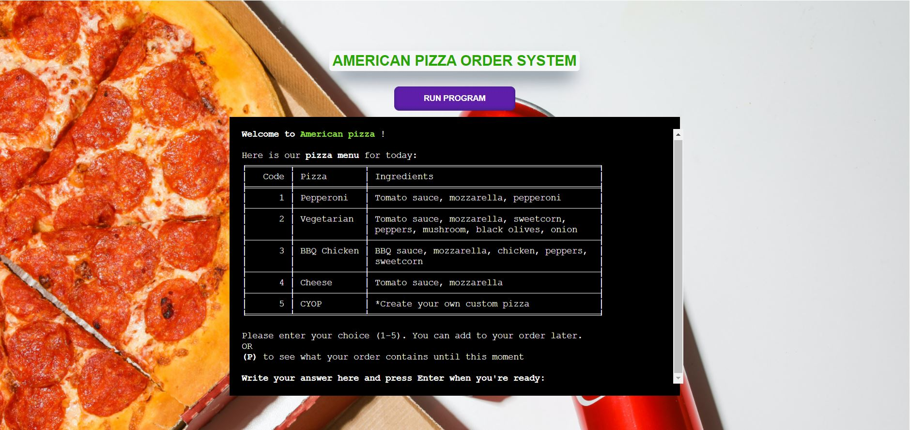](assets/images/full_image.JPG)

## UX/UI
### STRATEGY
#### Goals 
* The program should be intuitive to navigate 
* The information that appears on the screen should be relevant for each step of the order 
* Instructions should appear to sugerate the user what values to enter 
* The important information should be highlighted to offer a better user experience 
* The program should access the right datasheet for every step  
* The program should update the Orders data sheet with the right values 
* The order content and price has to be displayed to the user before the order is finished 
* The order duration time has to be calculated and displayed to the user after the order is finished 
* The program should give the possibility of checking the status of the order

#### User Stories 
* As a user, I want to see information about the pizza options that the restaurant offer 
* As a user, I want to be able to create my own custom pizza 
* As a user, I want to be able to add more types of pizzas to my order 
* As a user, I want to see the content of my order when deciding to add more food. 
* As a user, I want to be able to choose the quantity for each pizza 
* As a user, I want to see information about the total price and duration of the order 
* As a user, I want to be assigned a code for my order 
* As a user, I want to check my order status 

### SCOPE 
For the implementation of the ordering system I have planned the following features: 

* Data from spreadsheet about pizzas characteristics to be displayed to the user in tables 
* The Create Your Own pizza option that adds extra steps for the order 
* The user's options will be written on the screen 
* The program displays warnings when the input of the user doesn't respect the format 
* The option of displaying the order content  
* The program calculates and displays the order total price 
* The program calculates and displays the order total duration 
* The program assigns a number reference to the order 
* A table with the status of the order can be displayed 

### STRUCTURE 
The ordering system can be used by the clients through a mock terminal that appears when the link is accessed.
The terminal was created using the Code Institute template which is not my work but his <code>CSS</code> code has been adjusted to conform its design with the restaurant theme.
Apart from that, the program was made with <code>Python</code> as the only programming language used. The file which stores the entire code that appears in the terminal is named <code>run.py</code> and this is what Heroku will run when the program is used. 

### FLOWCHARTS 
The Flowchart for my program was created using <b>LucidChart</b> and it visually represents how the system works. 
[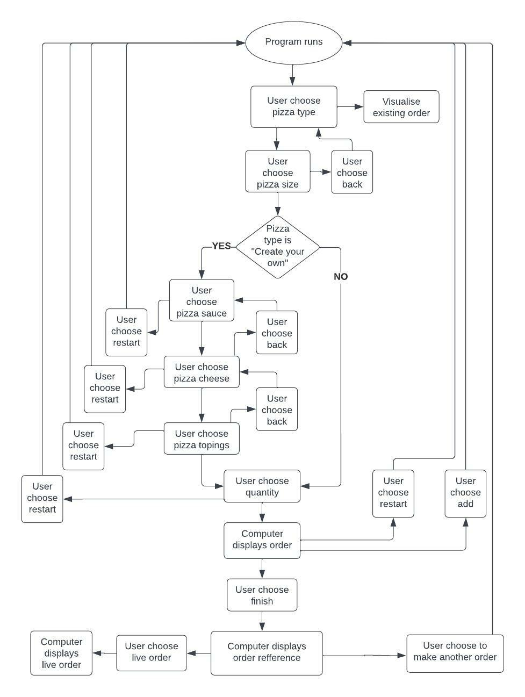](assets/images/blank_diagram.jpeg)

### SURFACE/DESIGN 
The ordering system displays pages as steps for completing the order. Every page contains information relevant to the user and a menu that will help him navigate through the program. 
#### Pizza Menu Page
* When the user first launches the program a welcome message is displayed and the pizza menu table. 
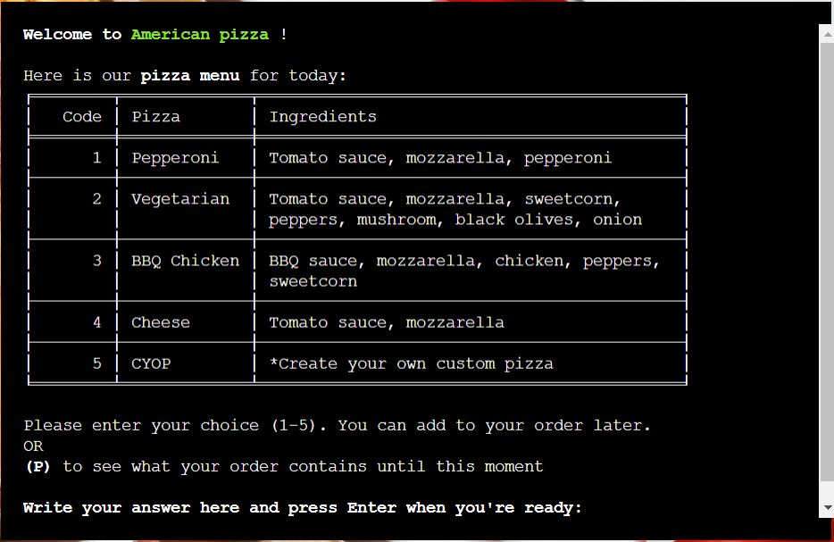 

#### Pizza Sizes Page
* In this step the user can see information about sizes and prices for the pizza. 
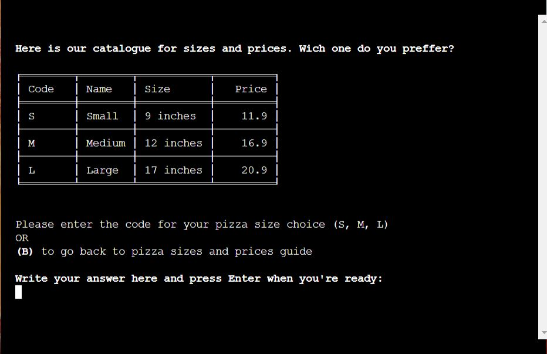  

If the user choose the option of Create Your Own pizza, three more aditional steps are added to the process. 
#### Pizza Sauces Page
* The user can see sauces option as the first step in creating a custom pizza.  
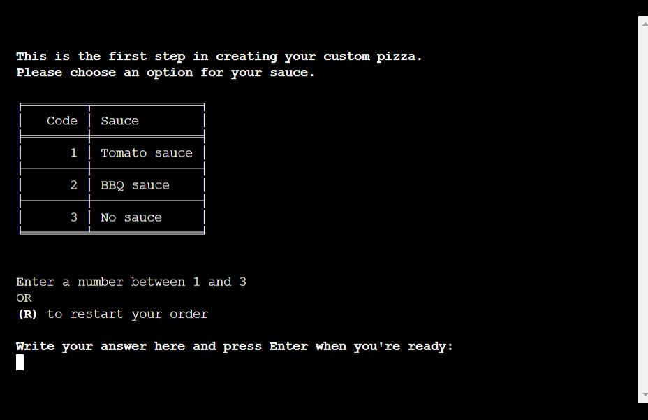 

#### Pizza Cheese Page
* A table with cheese options is displayed to the user as the second aditional step. 
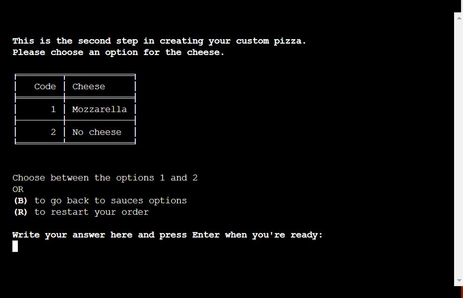 

#### Pizza Topings Page
* In this step the user can choose up to 5 topings for his custom pizza. 
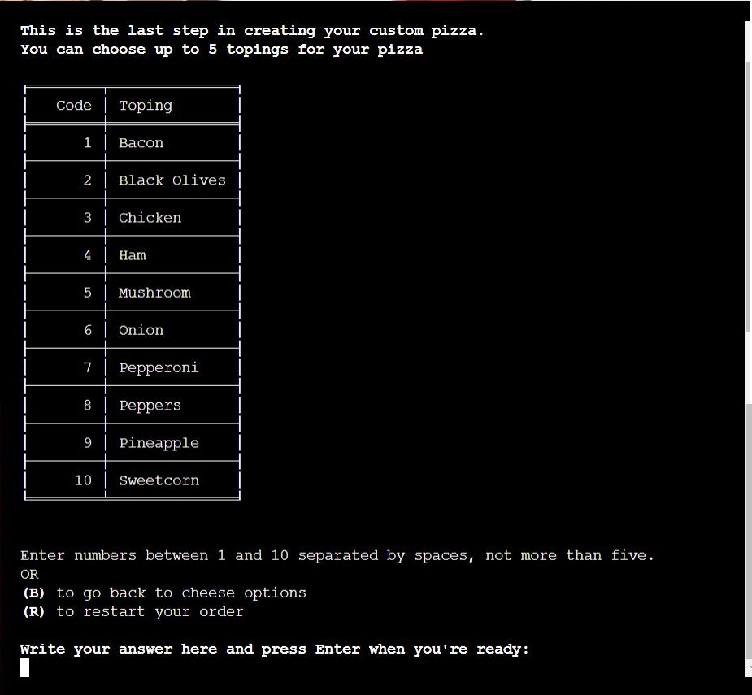 

#### Pizza Quantity Page
* Choosing a number for the quantity of pizza the client wants is one of the last steps in completing the order. 
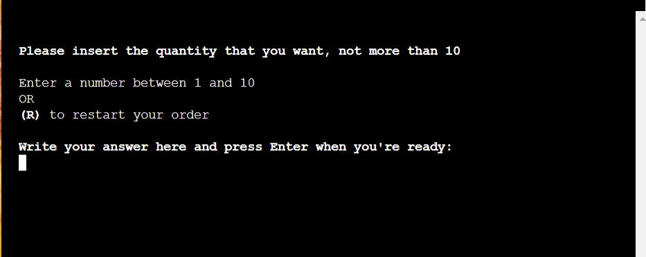 

#### Order Overview Page
* Before finishing the order, the user can see his order content and it's final price and it is given the option of adding to the order. 
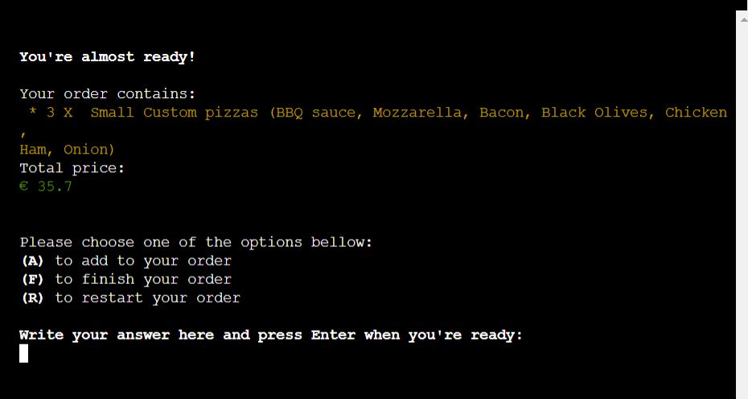 

#### Pizza Final Menu Page
* After processing the order, the client is informed about his number refference and the estimated time. 
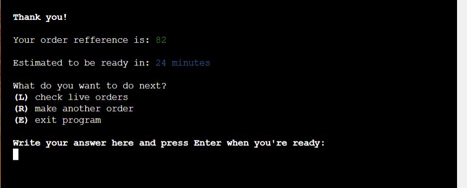 

#### Pizza Orders Live Status Page
* As an aditional step every user can access a Live Status table that updates its values every time it is loaded. 
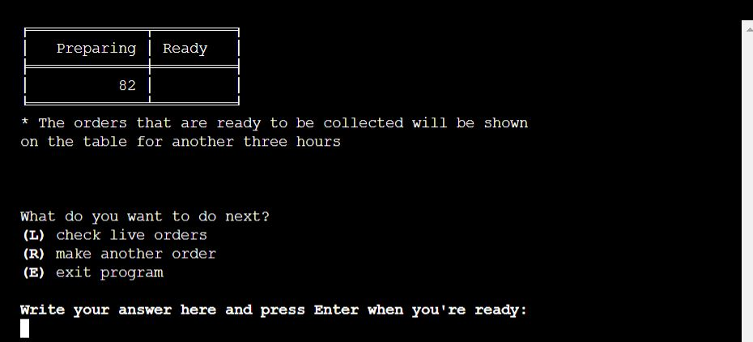 

## FEATURES
### EXISTING FEATURES 
The program has multiple features that were implemented to help the client and the restaurant owner as well. For simulating a real-life experience, the system is linked to a <b>Google Spreedsheet</b> that can be accessed [here](https://docs.google.com/spreadsheets/d/1DBQfkHd9fv4RQxQV-SxT5p1I38P6pLeuPQtpLCS1Axg/edit?usp=sharing).  

* The program displays real time informations about curent menu and pizza details in the form of a table by requesting data from the spreadsheet every time it is loaded.  
    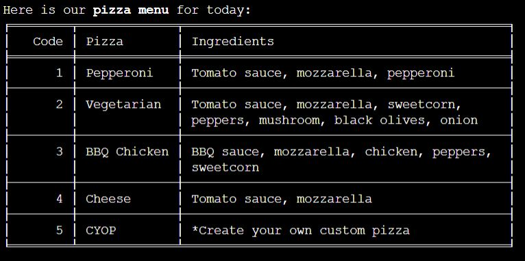
    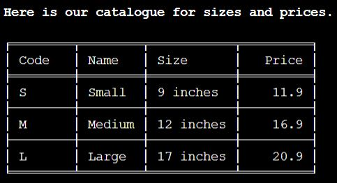
    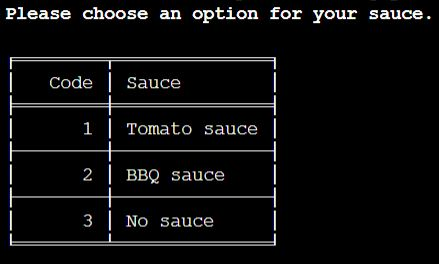
    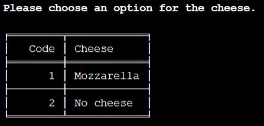
    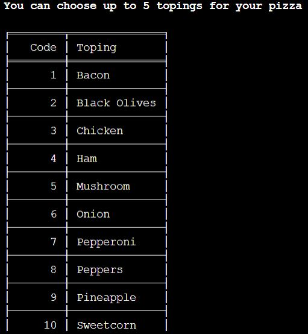 

* For a good user experience and to not risk breaking the program, I have implemented a feature that validates the user's input and gives him the right feedback. 
    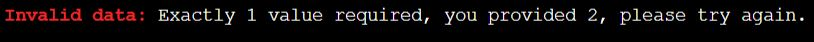
    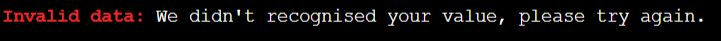
    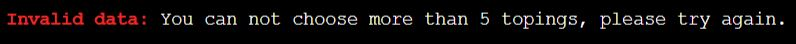
    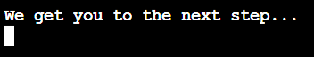

* The client has the possibility to see an overview of the order before processing it and on the first page in case he choses to add more pizzas type. 
    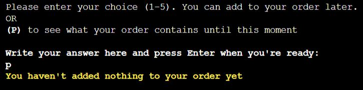
    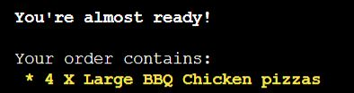

* The total price is calculated for every order by multiplying the quantity with the unit price for the specific size of the pizza chosen, and it is displayed as a part of the order overview before processing it. 
    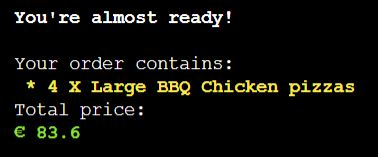

* Every order is given a reference to be used by the client when he checks his order status. This code is generated as a unique random number between 0 and 1000.  
    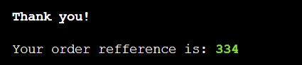

* Another important feature is the estimated time for the order which is calculated by multiplying the quantity with each pizza's time for preparation and adding 15 minutes for the oven cooking and 10 minutes for each extra pizza over the quantity of 10. 
    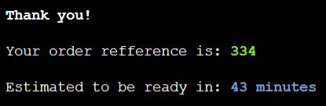

* When the user chooses to finish the order, a new line with all the order's details is inserted in the Orders Worksheet to keep a good track of them every day. 
    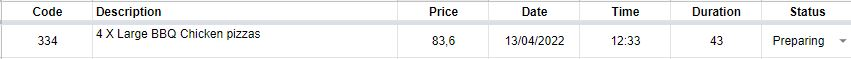

* The last feature I have implemented gives the client the possibility to check his order status by relating to his given reference. Every time a client wants to see the live orders, the Worksheet first updates the status for each order then it displays a table with the right values. 
    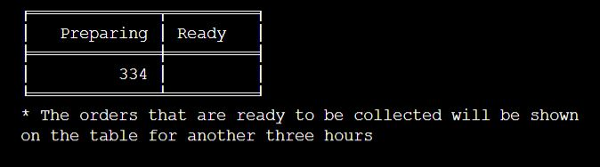

### FUTURE FEATURES 
* Create a user-friendly interface for the program that will facilitate the process of ordering.
* Update the algorithm that calculates the estimated time for preparing the order because at the moment it doesn't consider the orders that are already in preparation and could delay the time for the last orders to be done. 
* Implementing a secured card payment feature and the requesting of a completed payment code for cash payments cases, before processing the order. This feature should prevent unpleased situations of unpaid orders but firstly should come in help of the client by giving him more payment options.

## BUGS OR ERRORS
* During the development of the project, I have encountered a few problems when writing and testing the feature that updates the status for each order in the Google Spreadsheet because there were multiple bugs when trying to work with string and date and time type of values.
This feature calculates if the estimated duration for the order added to the time it was registered has overcome the current time to update its status from "Preparing" to "Ready", and if the overcoming time is more than three hours, the status will be "Finished".
Even if when I tested it worked properly, I noticed that the algorithm doesn't consider the date of the order as well and it didn't update the orders of the previous days as well.
The solution was to create a date and time type of variable with values from the Date and Time columns and compare them with the current date and time after adding the duration. 

## TESTING
The testing can be found at [TESTING.md](TESTING.md).

## MODULES IMPORTED
* <b>google.oauth2.service_account</b> for using the<code> Credentials </code> function on "creds.json" file that was used to link the program with the Google spreadsheet using the <b>gspread</b> module
* <b>os</b> module was imported for accessing <code>os.system</code> to clear the terminal
* <b>time</b> is the module used for delaying the feedback for the user with <code>time.sleep()</code>
* <b>datetime</b> module was very useful when needed to convert strings into datetime format with <code>datetime.strptime()</code>
* <b>random</b> is the module utilised for generating the order refference as a number between 1 and 1000 with <code>random.randint()</code>
* <b>itertools</b> module helped me iterate through two lists of different lengths with <code> itertools.zip_longest()</code>
* <b>pytz</b> was used for memorising the local timezone with <code>pytz.timezone()</code>
* From <b>termcolor</b> module I imported <code>colored</code> for printing text in different colors
* <b>tabulate</b> module imported the <code>tabulate</code> function for printing the tables

## DEPLOYMENT
### CREATING THE WEBSITE
I have used the [Code Institute Python Essentials Template](https://github.com/Code-Institute-Org/python-essentials-template) for creating a terminal where my Python code will generate its output.
The steps were as follows:
- Click the <i>Use this template</i> button
- A New Repository page will appear, write a Repository name and a short description and press <i>Create repository from template</i>
- Press the green Gitpod button to create your project workspace and start developing your website  
  
### DEPLOYING ON HEROKU
After finishing developing the program I deployed it on <b>Heroku</b> following the instructions:
- Create an account and login into [Heroku](https://id.heroku.com/login) website
- Click "New -> Create new app" button
- Insert your app's Name and Choose your region then click the "Create App" button
- Into the <i>Settings</i> tab go to "Config vars" section and click "Reveal Config Vars"
- Enter the PORT in the KEY section and 8000 for its value, then click "Add" 
- Go to "Buildpacks" section and click "Add buildpack" 
- Firstly add the <b>Python</b> buildpack then <b>NodeJs</b>
- Into the <i>Deploy</i> tab go to "Deployment method" and select <b>Github</b>
- After that go to "App connected to GitHub" and look for your GitHub repository name to link it
- You can now choose to either manually or automatically deploy your app to Heroku.
- With automatic deploys enabled, Heroku will build a new version of the app each time a change has been pushed to the repository
- Manual deploys means your app will be updated only when you manually click to deploy it
- When the deploying is finished, a link will be provided to you for accessing your app

### FORK THE REPOSITORY 
For creating a copy of the repository on your account and change it without affecting the original project, use<b>Fork</b> directly from GitHub:
- On [My Repository Page](https://github.com/useriasminna/american_pizza_order_system), press <i>Fork</i> in the top right of the page
- A forked version of my project will appear in your own repository  

### CLONE THE REPOSITORY
For creating a clone of the repository on your local machine, use<b>Clone</b>:
- On [My Repository Page](https://github.com/useriasminna/american_pizza_order_system), click the <i>Code</i> green button, right above the code window
- Chose from <i>HTTPS, SSH and GitClub CLI</i> format and copy (preferably <i>HTTPS</i>)
- In your <i>IDE</i> open <i>Git Bash</i>
- Enter the command <code>git clone</code> followed by the copied URL
- Your clone was created

## CREDITS
* The code for clearing the terminal was taken from [stackoverflow](https://stackoverflow.com/questions/2084508/clear-terminal-in-python)
* I learned how to work with data and time strings from [educative.io](https://www.educative.io/edpresso/how-to-convert-a-string-to-a-date-in-python)
* The code for linking to the Google Spreadsheet and manipulating it was taken and adapted from the Code Institute Love Sandwiches tutorial
  

## TOOLS
[GitHub](https://github.com/) - used for hosting the source code of the program 
[Gitpod Dev Environment](https://gitpod.io/) - used for testing the program 
[PEP8 Validator](http://pep8online.com/) - used for validating the python code 
[Heroku](https://dashboard.heroku.com/) - used for deploying the project 
[LucidChart](https://www.lucidchart.com/) - used for creating the Flowchart
[Favicon.io](https://favicon.io/) - used for generating the website favicon 
[Diffchecker](https://www.diffchecker.com/) - used for comparing the code 
[HTML - W3C HTML Validator](https://validator.w3.org/#validate_by_uri+with_options) - used for validating the HTML 
[CSS - Jigsaw CSS Validator](https://jigsaw.w3.org/css-validator/#validate_by_uri) - used for validating the CSS 

## ACKNOWLEDGEMENTS
- Code Institute for all the material and support offered 
- My mentor Ben Kavanagh for great tips and his willingness to help me as much as possible with the problems encountered during the development of the project 
- Slack community for great involvement in helping each other 

