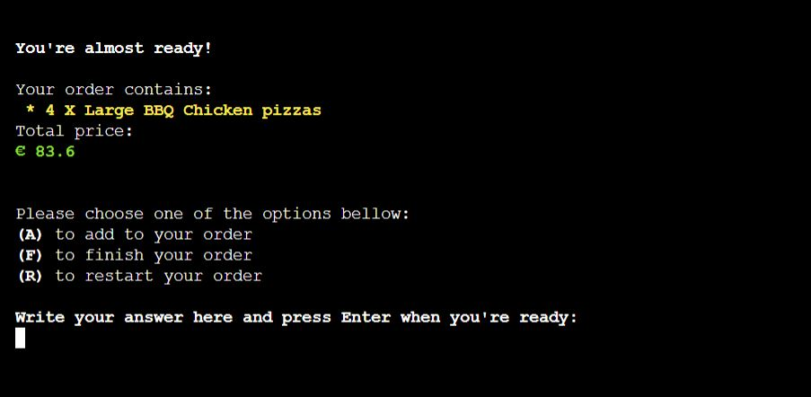

# AMERICAN PIZZA - ORDER SYSTEM
## OVERVIEW
I created a fully functional order system for a fictional restaurant called American Pizza, whose field of activity is the preparation and serving of pizza inspired by american fast-food. The main purpose of this program is to facilitate the process of taking orders by introducing a system that automatically populate a google spreadsheet with data about each order for a better monitoring. Also it is very useful for the restaurant's clients because it estimates the waiting time for each order and it gives them the option to check their order status live.
American Pizza order system was created entirely with Python and cand be used through the terminal implemented with the Code Institute Python Template whose design was adapted to respect the restaurant theme.
  
The fully deployed project can be accesed at [this link](https://american-pizza-order-system.herokuapp.com/). 

## UX/UI
### STRATEGY
#### Goals 
* The program should be intuitive to navigate 
* The informations that appear on the screen should be relevant for each step of the order 
* Instructions should appear to sugerate the user what values to enter 
* The important informations should be highlighted to offer a better user experience 
* The program should access the right data sheet for every step  
* the program should update the Orders data sheet with the right values 
* The order content and price has to be displayed to the user before the order is finished 
* The order duration time has to be calculated and displayed to the user after the order is finished 
* The program should give the possibility of checking the status of the order

#### User Stories 
* As a user, I want to see informations about the pizza options that the restaurant offer 
* As a user, I want be able to create my own custom pizza 
* As a user, I want to be able to add more type of pizzas to my order 
* As a user, I want to see the content of my order when deciding to add more food. 
* As a user, I want to be able to choose the quantity for each pizza 
* As a user, I want to see informations about the total price and duration of the order 
* As a user, I want to be assigned a code for my order 
* As a user, I want to check my order status 

### SCOPE 
For the implementation of the ordering system I have planned the following features: 

* Data from spreadsheet about pizzas characteristics to be displayed to the user in tables 
* The Create Your Own pizza option that adds extra steps for the order 
* The user's options will be writen on the screen 
* The program displays warnings when the input of the user doesn't respect the format 
* The option of displaying the order content  
* The program calculates and displays the order total price 
* The program calculates and displays the order total duration 
* The program assign a number refference to the order 
* A table with the orders status can be displayed 

### STRUCTURE 
The ordering system can be used by the clients through a mock terminal that appears when the link is accessed.
The terminal was created using the Code Institute template which is not my work but his <code>CSS</code> code has been adjusted to conform it's design with the restaurant theme.
Apart from that, the program was made with <code>Python</code> as the only programming language used. The file which stores the entire code that appears in the terminal is named <code>run.py</code> and this is what Heroku will run when the program is used. 

### FLOWCHARTS 
The Flowchart for my program was created using <b>LucidChart</b> and it visually represents how the system works. 

### SURFACE/DESIGN 
The ordering system displays pages as steps of completing the order. Every page contains informations relevant to the user and a menu that will help him navigate through the program. 
#### Pizza Menu Page
* When the user first launches the program a welcome message is displayed and the pizza menu table. 
 

#### Pizza Sizes Page
* In this step the user can see information about sizes and prices for the pizza. 
  

If the user choose the option of Create Your Own pizza, three more aditional steps are added to the process. 
#### Pizza Sauces Page
* The user can see sauces option as the first step in creating a custom pizza.  
 

#### Pizza Cheese Page
* A table with cheese options is displayed to the user as the second aditional step. 
 

#### Pizza Topings Page
* In this step the user can choose up to 5 topings for his custom pizza. 
 

#### Pizza Quantity Page
* Choosing a number for the quantity of pizza the client wants is one of the last steps in completing the order. 
 

#### Order Overview Page
* Before finishing the order, the user can see his order content and it's final price and it is given the option of adding to the order. 
 

#### Pizza Final Menu Page
* After processing the order, the client is informed about his number refference and the estimated time. 
 

#### Pizza Orders Live Status Page
* As an aditional step every user can access a Live Status table that updates its values every time it is loaded. 
 

## FEATURES
### EXISTING FEATURES 
The program has multiple features that were implemented to help the client and the restaurant owner as well. For simulating a real life experience, the system is linked to a <b>Google Spreedsheet</b> that can be accessed [here](https://docs.google.com/spreadsheets/d/1DBQfkHd9fv4RQxQV-SxT5p1I38P6pLeuPQtpLCS1Axg/edit?usp=sharing).  

* The program displays real time informations about curent menu and pizza details in the form of a table by requesting data from the spreadsheet every time it is loaded.  
    
    
    
    
     

* For a good user experience and to not risk breaking the program, I have implemented a feature that validates the user's input and gives him the right feedback. 
    
    
    
    

* The client has the possibility to see an overview of the order before processing it and on the first page in case he choses to add more pizzas type. 
    
    

* The total price is calculated for every order by multipling the quantity with the unit price for the specific size of the pizza chosen, and it is displayed as a part of the order overview before processing it. 
    

* Every order is given a refference to be used by the client when he checks his order status. This code is generated as a unique random number between 0 and 1000.  
    

* Another important feature is the estimated time for the order which is calculated by multipling the quantity with each pizza's time for preparation and adding 15 minutes for the oven cooking and 10 minutes for each extra pizza over the quantity of 10. 
    

* When the user choose to finish the order, a new line with all the order's details is inserted in the Orders Worksheet to keep a good track of them every day. 
    

* The last feature I have implemented it gives the client the possibility to chech his order status by relating to his given refference. Every time a client wants to see the live orders, the Worksheet first updates the status for each order then it displays a table with the right values. 
    

### FUTURE FEATURES 
* Create an user-friendly interface for the program that will facilitate the process of ordering.
* Update the algorithm that calculates the estimated time for preparing the order because at the moment it doesn't consider the orders that are already in preparation and could delay the time for the last orders to be done. 

