# TESTING
Testing was divided into three sections:
  - [VALIDATORS TESTING](#validators-testing)
  - [USER STORIES TESTING](#user-stories-testing)
  - [FEATURES TESTING](#features-testing)

## VALIDATORS TESTING  
### PEP8 Validator
I tested my Python code and there are no errors.
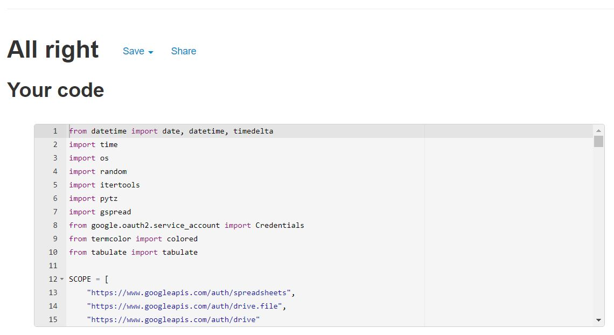

### HTML Validator
Because I added some elements in the layout.html file I tested my code for errors.
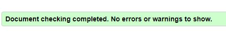

### CSS Validator
The whole website was tested and its free from errors in CSS.
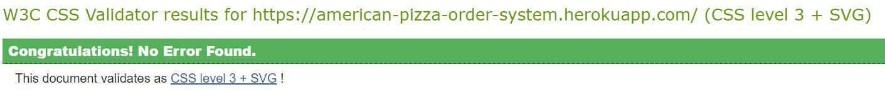

### Lighthouse 
I generated a lighthouse report to check my performance and the scores are good. The lower score for the SEO is caused by the lack of the meta description.
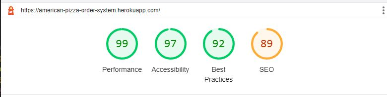

## USER STORIES TESTING
<b>User Story: </b>As a user, I want to see informations about the pizza options that the restaurant offer 
<b>Outcome: </b> All the necessary informations for completing an order are displayed to the user in tables. The data is pulled from the Google spreadsheet where the menu and prices are updated manually by the owner of the restaurant. There are available for the clients tables with the menu of the day, sizes available, prices and for custom pizza the client can choose from a range of ingredients available. This user story is accomplished because the clients have all the necessary informations at their disposal.   
<b>User Story: </b>As a user, I want be able to create my own custom pizza 
<b>Outcome: </b>Every client has the possibility to choose from a range of pizza types or create his own custom pizza by entering "5" in the first page input place. What this action does is adding three more extra steps to the process of ordering, for choosing the sauce, cheese and topings for the custom pizza. This user story was tested and fulfilled. All the steps are coming in order, in a logical way, and the custom pizza is added to the order with a full description for the cook to see it.   
<b>User Story: </b>As a user, I want to be able to add more type of pizzas to my order 
<b>Outcome: </b>At the end of the order process, the client is given the option to add more pizza types to the order by entering "A" in the order overview page. This action will redirect the user to the first page of the order, with the current pizza menu, and will guide him through the whole process again.  
This action can be done as many times as the client wishes. 
All the food that is added will be visible in the overview for the client to decide if he wants to add more or finish the order. After processing the order, a total description with all the food that was added will be inserted into the Google Spreedsheet. 
This user story is accomplished  
<b>User Story: </b>As a user, I want to see the content of my order when deciding to add more food. 
<b>Outcome: </b>Apart from the overview that is displayed to the user at the end of the ordering process, in the first page there is available for the clients the option to look once more through the content of their orders because there is no other option of going back to the overview. 
By entering "P", a list with the pizza's quantity, name and ingredients by case will be visible to the clients that already added something in their "shopping cart" and a sugestive string otherwise. 
The clients need for being able to see their order content for making their decision of buying easier was identified and this user story was respected.  
<b>User Story: </b>As a user, I want to be able to choose the quantity for each pizza 
<b>Outcome: </b>As a final stape, any client can add a quantity between 1 and 10 for each pizza type they added. This value will be memorised and added to the description of the order. Also this value is taking in consider when calculating the price and the order's duration. 
This user story was tested and is successfully accomplished because it also helped at reducing the number of steps for the client and making his buying experience better.  
<b>User Story: </b>As a user, I want to see informations about the total price and duration of the order 
<b>Outcome: </b>For an order to be complete, I identified the need of seeing details about price and duration, to help the customers make the best decision when ordering, and reduce the risk of unpaid orders because of unsitisfied clients. 
The price is visible to the user before making the final decision of finishing the order, to give him the chance of making changes to it if he wants to. After the order is processed, an estimated time for the whole order to be ready is displayed. 
After many tests, it resulted that these values are corrrectly calculated and they contributed at accomplishing this user story.  
<b>User Story: </b>As a user, I want to be assigned a code for my order 
<b>Outcome: </b>It is essential for the client to identify his order and this user story was accomplished by assigning a number refference for each order. I considered that this option would be more suitable than requesting personal data as name, phone number and others. 
This number is what makes the client and the cookers recognise the order and it is used as a refference when checking the status of it. At the end of every order, this unique code is displayed to the user in blue color to make it more visible  
<b>User Story: </b>As a user, I want to check my order status 
<b>Outcome: </b>The program was implemented to satisfy this clients need for improving their experience with American Pizza restaurant. 
In the final menu any client can choose to see the orders status by entering "L". A table with orders code refferences appear with values from the Google spreadsheet and it separates the them in two columns, "Preparing" and "Ready". The statuses are updated every time this request is made by any client and can also be changed manually in the spreadsheet, by a cooker or any authorized personal. This helps mentaining a real time status for each order. This user story was tested and succesfully accomplished.  

## FEATURES TESTING

* <b>Real time informations requested from the Google SpreadSheet</b> 
  -This feature was tested by comparing the output from the terminal with the content that exists at that moment in the corresponding worksheet.  
    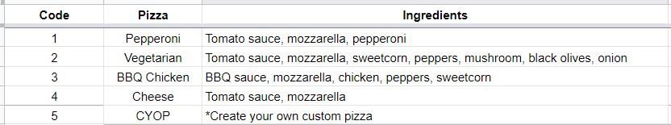
      
  -Also, this was tested by changing values in the worksheet and the terminal prints the coresponding content.   
    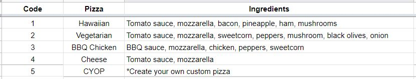
    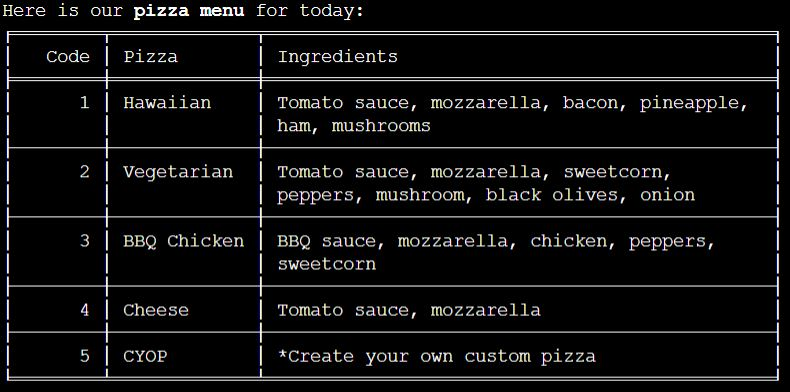

* <b>Input validation at every step</b> 
  I have implemented the <code>validate_data()</code> method that is called at every step in the ordering process for validating the input of the user. This method can be adapted to any kind of requirements for the user's input by changing it's paremeters values. 
  The <code>values</code> paremeter gets the list with the user's entered values, <code>list_to_check</code> is for setting the values that are accepted as a response and <code>number_of_values_required</code> is the number of values requested.  
  This feature was tested by simulating client's different entered values to see what is the output.  

  -The user enters a values that doesn't respect the format. 
    <b>Prameters values:</b> <code>values</code> = ["1"], <code>list_to_check</code> = ["S", "M", "L", "B"], <code>number_of_values_required</code> = 1 
    <b>Output:</b> 
    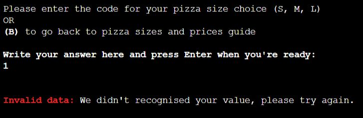  
  -In most cases only one value is accepted. Here the client inserts more than 1 value. 
    <b>Prameters values:</b> <code>values</code> = ["S", "M", "L", "1"], <code>list_to_check</code> = ["S", "M", "L", "B"], <code>number_of_values_required</code> = 1 
    <b>Output:</b> 
    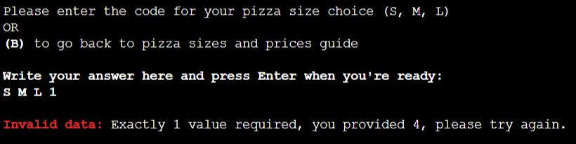  
  -At the "Topings" step, the client cannot choose more than five values. In this case there were more than five values inserted. 
    <b>Prameters values:</b> <code>values</code> = ["1", "2", "3", "4", "5", "6"], <code>list_to_check</code> = ["1", "2", "3", "4", "5", "6", "7", "8", "9", "10", "B", "R"], <code>number_of_values_required</code> = 5 
    <b>Output:</b>  
    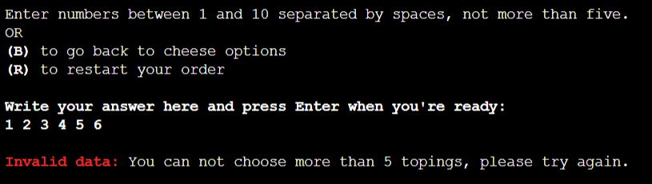  
  -For the case were the user's input is valid, a sugestive message is displayed to tell him the process continues. I decided to not make the input case sensitive for an easier experience. 
    <b>Prameters values:</b> <code>values</code> = ["S"], <code>list_to_check</code> = ["S", "M", "L", "B"], <code>number_of_values_required</code> = 1 
    <b>Output:</b>  
    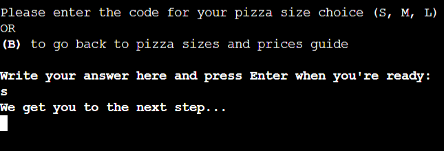
    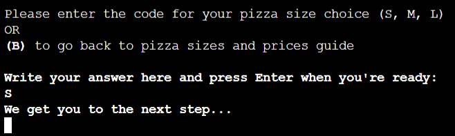
